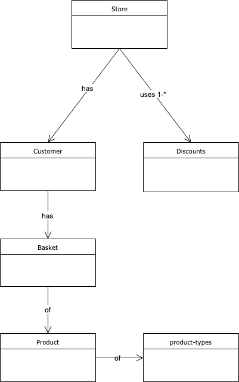

# retail-store

Retail store sample with test suite.



## Usage

Download the latest version of [Node.js](https://nodejs.org/en/download/)

Clone repo

```bash
git clone git@github.com:tannerla/retail-store.git
```

Install dependencies

```bash
cd retail-store
npm install
```

Run app

```bash
npm start
```

Run tests

```bash
npm test
```

Test coverage is provided in your shell by running `npm test`.  It is also provided in report format under `./coverage` after running the above command.

## License

ISC
